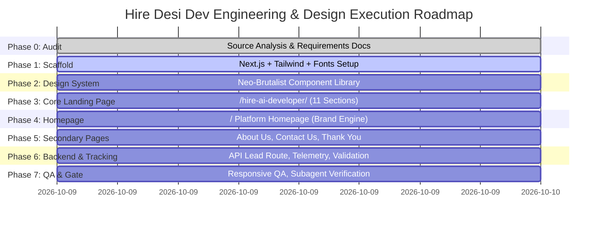

# IMPLEMENTATION ROADMAP: HIRE DESI DEV / HIRE AI DEVELOPER

**Project**: Hire Desi Dev Platform  
**Target Completion**: Production Grade  
**Architectural Stack**: Next.js (App Router), TypeScript, Tailwind CSS, Lucide React  

---

## IMPLEMENTATION PHASES

---

## DETAILED EXECUTION TASKS

### Phase 1: Scaffold & Architecture
- [x] Extract and audit all 7 embedded specification documents from source HTML bundle.
- [x] Create core documentation (`docs/source-audit.md`, `docs/site-map.md`, `docs/design-direction.md`, `docs/implementation-roadmap.md`).
- [ ] Initialize Next.js project with TypeScript, Tailwind CSS, ESLint, PostCSS.
- [ ] Configure `tailwind.config.ts` with custom DESI BRUTAL design tokens (colors `#F7F5EF`, `#171717`, `#3659F5`, `#E8FF63`, hard shadows, typography scales).
- [ ] Set up Google Fonts (`Space Grotesk`, `Inter`, `JetBrains Mono`) with `@next/font/google` or optimized font loading.

### Phase 2: Design Tokens & Reusable Component Library
- [ ] `BrutalButton`: High-tactile button with near-black, cobalt, acid yellow, and outline variants + offset shadow states.
- [ ] `BrutalCard`: Square-cornered, border-2 card with hard shadow and optional metadata header.
- [ ] `BrutalBadge`: Monospace technical label for availability, skills, and engagement models.
- [ ] `RequirementForm`: Shared 3-way engagement switcher (`Hourly` | `Monthly` | `Fixed cost`), searchable country dropdown (22 target markets prioritized), developer requirement selector, validation, and submission handler.
- [ ] `GlobalHeader`: Platform navigation with categories dropdown, mobile slide drawer, and instant CTA.
- [ ] `ConversionHeader`: Distraction-free conversion header for `/hire-ai-developer/` (brand mark + emergency contact, no outbound navigation).
- [ ] `GlobalFooter`: Neo-brutalist footer with Nova Spark heritage acknowledgement, links, and copyright.
- [ ] `BrutalAccordion`: Keyboard-accessible FAQ component with animated toggle state.
- [ ] `StickyMobileCta`: Bottom-docked sticky button for mobile views on the landing page.

### Phase 3: Dedicated Conversion Landing Page (`/hire-ai-developer/`)
- [ ] Implement Section 01: Headline & Hero CTA (Offset layout).
- [ ] Implement Section 02: Requirement Form 1 (Above the fold on desktop, immediately beneath headline on mobile).
- [ ] Implement Section 03: Developer Profiles Grid (6 specialties: AI/ML, Generative AI, LLM, Agent, Computer Vision, NLP).
- [ ] Implement Section 04: Technology Stack (13 verified tech tags).
- [ ] Implement Section 05: Requirement Form 2 (Mid-page contextual form on mist background).
- [ ] Implement Section 06: Why Us (4 value pillars) & 3 Engagement Models (Hourly, Monthly, Fixed Cost).
- [ ] Implement Section 07: How It Works (4 numbered steps).
- [ ] Implement Section 08: Client Logos (5 honest enterprise placeholders with strict veracity disclaimer).
- [ ] Implement Section 09: Case Studies & Evaluation Methodology (Truthful talent vetting cards).
- [ ] Implement Section 10: Requirement Form 3 (Final full intake form on dark navy/near-black band).
- [ ] Implement Section 11: Final Call to Action (Acid yellow high-impact band with scroll anchor).
- [ ] Verify 390px mobile view with sticky action bar.

### Phase 4: Platform Homepage (`/`)
- [ ] Implement Asymmetric Hero with primary headline ("GOOD PEOPLE. SERIOUS BUILDING.") and supporting value statement.
- [ ] Implement Live Interactive Matching Engine: Allows visitors to select or type a requirement and immediately preview a matched Indian engineering profile.
- [ ] Implement Developer Categories Grid (AI/ML, Full Stack, Frontend, Backend, Mobile, DevOps).
- [ ] Implement Why Hire Desi Dev Grid (Technical fit, timezone overlap, clear communication, engineering support).
- [ ] Implement 4-Step Process & 3 Engagement Models.
- [ ] Implement FAQ & High-Conversion CTA.

### Phase 5: About Us, Contact Us & Confirmation Pages
- [ ] Build `/about-us/`: Nova Spark roots, 4-stage talent engine (Find, Filter, Match, Provide), 3 core principles.
- [ ] Build `/contact-us/`: Direct Chandigarh-Mohali office coordinates, inquiry form, and emergency chat route.
- [ ] Build `/thank-you/`: Conversion confirmation with submission tracking details, expected timeline, and interview prep guidance.

### Phase 6: Telemetry & Backend Integration
- [ ] Create `/api/lead` Next.js route: Validates incoming payloads, logs structured lead telemetry, attaches detected metadata (IP/country/UTMs/form position), and returns submission confirmation.
- [ ] Implement event listeners for required brief events: `generate_lead`, `cta_click`, `form_start`, `engagement_select`, `scroll_50`.

### Phase 7: Quality Gate & Visual Subagent Verification
- [ ] Run full TypeScript typecheck (`tsc --noEmit`) and fix all issues.
- [ ] Run Next.js build (`npm run build`) to ensure static and dynamic routes compile cleanly.
- [ ] Launch development server and run browser subagent tests at 390px, 768px, 1280px, and 1440px.
- [ ] Validate WCAG contrast, touch targets, and ensure ZERO prohibited words (no "cheap", no "discount", no prices anywhere).
