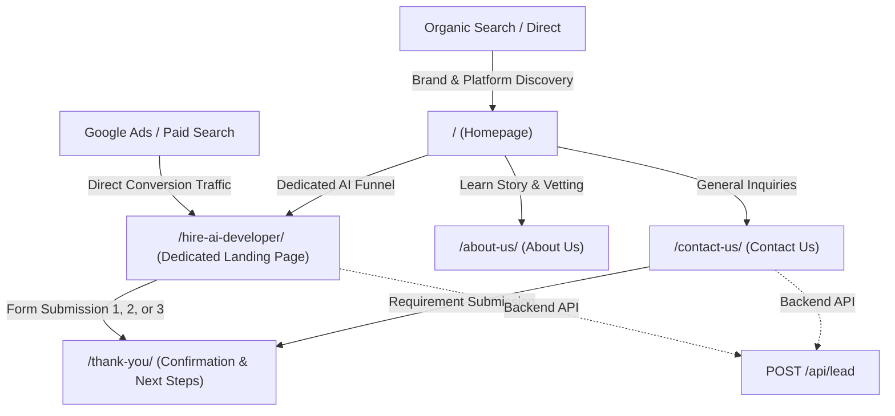

# SITE MAP & INFORMATION ARCHITECTURE: HIRE DESI DEV

**Domain / App Scope**: Hire Desi Dev / Hire AI Developer  
**Status**: Production Architecture Blueprint  
**Parent Entity**: Nova Spark Digital Marketing  

---

## 1. ROUTING & PAGE INVENTORY

---

## 2. DETAILED PAGE SPECIFICATIONS

### Page 1: Dedicated Conversion Landing Page
- **Route**: `/hire-ai-developer/`
- **Shell**: **Conversion-Focused Focus Shell** (Minimalist top bar: brand mark + status badge + emergency contact; **no** header or footer navigation links to eliminate drop-offs).
- **H1**: *Hire AI Developers at Hourly, Monthly & Fixed Cost*
- **SEO Title**: `Hire AI Developers | Hourly, Monthly or Fixed Cost`
- **Meta Description**: `Hire vetted AI developers, machine learning engineers, and LLM specialists from India. Flexible hourly, monthly, or fixed-cost engagements.`
- **Target Keywords**: `Hire AI Developer`, `Hire AI Engineer`, `AI Developer for Hire`, `LLM Engineer`, `Generative AI Developer`.
- **Primary Conversion Anchor**: Form 1 (Above fold), Form 2 (Mid-page mist band), Form 3 (Final high-contrast band).
- **Sticky Mobile Element**: Persistent bottom action bar on viewports < 768px.

### Page 2: Platform Homepage
- **Route**: `/`
- **Shell**: **Global Brand Shell** (Full navigation bar with category dropdown, desktop CTAs, mobile slide drawer, and comprehensive neo-brutalist footer).
- **H1**: *GOOD PEOPLE. SERIOUS BUILDING.* (Sub-head: *Your AI & Engineering Talent Partner*)
- **SEO Title**: `Hire Desi Dev | Connect with Vetted Indian Developers`
- **Meta Description**: `Connect with curated, vetted Indian software engineers and AI developers. Dedicated monthly talent, hourly specialists, and fixed-cost delivery teams.`
- **Key Sections**:
  1. Editorial Asymmetric Hero
  2. Verified Enterprise Trust & Vetting Guarantee
  3. Interactive Requirement-to-Developer Matching Engine (Live Simulation)
  4. Core Developer Categories (AI/ML, Full Stack, Frontend, Backend, Mobile, DevOps)
  5. Why Hire Desi Dev (Business Benefits Grid)
  6. 4-Step Engagement Process (Numbered editorial timeline)
  7. 3 Engagement Models (Hourly, Monthly, Fixed Cost)
  8. Talent Vetting & Evaluation Methodology (Truthful alternative to fabricated reviews)
  9. Frequently Asked Questions (Accessible Neo-Brutalist Accordion)
  10. High-Contrast Final Call to Action
  11. Complete Brand Footer with Nova Spark heritage attribution

### Page 3: About Us
- **Route**: `/about-us/`
- **Shell**: Global Brand Shell
- **H1**: *A Talent Business Built Around Elite Technical Execution*
- **SEO Title**: `About Us | Hire Desi Dev & Nova Spark Digital Marketing`
- **Meta Description**: `Learn about Hire Desi Dev, born from Nova Spark Digital Marketing to connect international businesses with top-tier Indian engineering talent.`
- **Key Sections**:
  1. Mission & Vision Statement
  2. Company Roots (From Nova Spark growth marketing to deep engineering talent)
  3. The 4-Stage Talent Engine (Find, Filter, Match, Provide)
  4. Three Guiding Principles (Specialist Focus, Requirement First, Radical Flexibility)
  5. The Engineering Standards Board (Code quality, architectural rigor, communication)
  6. Final Direct Intake CTA

### Page 4: Contact Us
- **Route**: `/contact-us/`
- **Shell**: Global Brand Shell
- **H1**: *Direct Engineering Consultation & Inquiries*
- **SEO Title**: `Contact Us | Hire Desi Dev & Engineering Talent Desk`
- **Meta Description**: `Get in touch with our talent matching team in Chandigarh–Mohali. Fast turnaround for project requirements and developer matching.`
- **Key Sections**:
  1. Contact Hero with Response Guarantee (< 4 hour response time)
  2. Direct Office Details:
     - Location: Chandigarh–Mohali IT Corridor, India
     - Email: `talent@hiredesidev.com`
     - Phone / WhatsApp: `+91 (172) 500-DESI`
  3. Comprehensive Requirement Intake Form (Synchronized with landing page schema)
  4. Direct Route to `/hire-ai-developer/` for immediate AI-specific specs.

### Page 5: Lead Confirmation Page
- **Route**: `/thank-you/`
- **Robots Directive**: `noindex, nofollow`
- **H1**: *Requirement Received. We Are Matching Your Engineer.*
- **SEO Title**: `Requirement Submitted | Hire Desi Dev`
- **Content**:
  - Unique Submission ID reference
  - Expected next steps (What happens in the next 12–24 hours)
  - Preparation checklist for candidate interview
  - Direct WhatsApp quick-connect option

---

## 3. RESPONSIVE BREAKPOINT SYSTEM

| Breakpoint | Target Screen | Layout Strategy |
|---|---|---|
| `390px` | iPhone 12/13/14/15/16 | Form immediately below hero text, 48px touch targets, single column, sticky bottom CTA bar |
| `768px` | iPad / Tablet portrait | Two-column cards, collapsible mobile nav drawer, 52px button heights |
| `1024px` | Tablet landscape / Small laptop | Side-by-side hero + Form 1, full desktop navigation with dropdown |
| `1280px` | Desktop standard | Generous editorial typography, offset card shadows, asymmetric badge grids |
| `1440px+` | Large desktop & 4K | Max-width 1360px container with consistent gutters, crisp geometric alignment |
